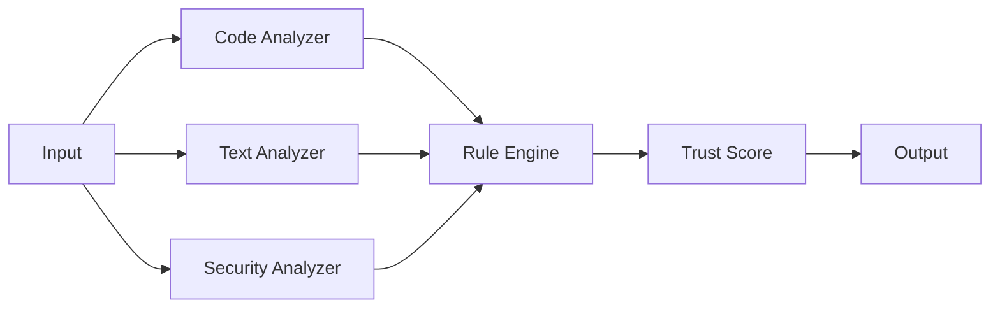

# Analyzers Overview

Vow uses a multi-analyzer architecture to detect different types of issues in AI-generated content. Each analyzer specializes in a particular domain and contributes to the overall trust score.

## Available Analyzers

| Analyzer | Purpose | Languages | Model Size |
|----------|---------|-----------|------------|
| [Code](code-analyzer.md) | Detects hallucinated APIs, imports, and syntax issues | Python, JavaScript, TypeScript, Go, Rust | ~50MB |
| [Text](text-analyzer.md) | Identifies fabricated facts, inconsistencies, and style issues | Any text content | ~75MB |
| [Security](hallucination-detection.md) | Finds security vulnerabilities and dangerous patterns | All | ~25MB |

## How Analyzers Work

### 1. Content Detection
First, Vow identifies sections that are likely AI-generated using:
- Entropy analysis (detecting unnatural patterns)
- Style consistency checks
- Common AI output markers
- User annotations (`<!-- AI-generated -->`)

### 2. Analyzer Pipeline
Each enabled analyzer processes the content independently:



### 3. Issue Detection
Analyzers look for specific issue patterns:

```yaml
# Example issue types
code_issues:
  - hallucinated_imports    # Non-existent packages
  - invalid_apis           # Fabricated endpoints  
  - syntax_errors          # Malformed code
  - deprecated_usage       # Outdated APIs

text_issues:
  - factual_errors         # Contradicts known facts
  - broken_references      # Invalid URLs/citations
  - inconsistencies        # Self-contradictory content
  - style_anomalies        # Unnatural writing patterns

security_issues:
  - hardcoded_secrets      # API keys, passwords
  - injection_patterns     # SQL injection, XSS
  - dangerous_functions    # eval(), exec(), etc.
  - privilege_escalation   # Unsafe permissions
```

## Analyzer Selection

### Automatic Selection
By default, Vow automatically selects analyzers based on file type:

```bash
# Python files → Code + Security analyzers
vow check script.py

# Markdown files → Text + Security analyzers  
vow check document.md

# Mixed directory → All analyzers
vow check ./project
```

### Manual Selection
Override automatic selection with `--analyzers`:

```bash
# Use only code analyzer
vow check file.py --analyzers code

# Use multiple specific analyzers
vow check . --analyzers code,security

# Exclude text analyzer
vow check . --exclude-analyzers text
```

### Configuration File
Set default analyzers in `.vow.yaml`:

```yaml
analyzers:
  # Enabled analyzers (default: auto)
  enabled:
    - code
    - text
    - security
  
  # Auto-selection rules
  auto_select:
    "*.py": [code, security]
    "*.js": [code, security]
    "*.md": [text]
    "*.rst": [text]
    "*": [code, text, security]
```

## Performance Considerations

### Model Loading
- Models are loaded once and cached in memory
- First run may be slower (~2-3 seconds)
- Subsequent runs are faster (~100-500ms per file)

### Resource Usage
| Analyzer | RAM Usage | CPU Usage | Disk I/O |
|----------|-----------|-----------|----------|
| Code | ~200MB | Medium | Low |
| Text | ~300MB | High | Low |
| Security | ~100MB | Low | Low |

### Optimization Tips

```bash
# Skip model loading for syntax-only checks
vow check file.py --no-ml-models

# Use faster, less accurate models
vow check . --model-size small

# Parallel processing for large directories
vow check . --jobs 4

# Cache results for unchanged files
vow check . --cache
```

## Trust Score Calculation

Each analyzer contributes to the overall trust score:

```
Trust Score = weighted_average(analyzer_scores)

Where:
- Code Analyzer Weight: 40%
- Text Analyzer Weight: 35%
- Security Analyzer Weight: 25%
```

### Score Interpretation
- **0.8-1.0**: High confidence (green)
- **0.6-0.8**: Medium confidence (yellow)  
- **0.3-0.6**: Low confidence (orange)
- **0.0-0.3**: Very low confidence (red)

## Custom Analyzers

Vow supports custom analyzers via WASM plugins:

```bash
# Install a custom analyzer
vow analyzers install my-analyzer.wasm

# List installed analyzers
vow analyzers list

# Use custom analyzer
vow check file.py --analyzers my-analyzer
```

See [Writing Custom Analyzers](../advanced/custom-analyzers.md) for details.

## Debugging Analyzers

### Verbose Output
```bash
# Show analyzer decisions
vow check file.py --verbose

# Debug specific analyzer
vow check file.py --debug-analyzer code
```

### Analyzer Logs
```bash
# Show performance metrics
vow check . --stats

# Export detailed logs
vow check . --log-file vow.log --log-level debug
```

### Validation Mode
```bash
# Test analyzers without ML models
vow check file.py --dry-run

# Validate analyzer configuration
vow analyzers validate
```

## Next Steps

- [Code Analyzer](code-analyzer.md) - Detailed guide to code analysis
- [Text Analyzer](text-analyzer.md) - Understanding text verification  
- [Security Analyzer](hallucination-detection.md) - Security-focused checking
- [Configuration](../configuration/config-file.md) - Customize analyzer behavior